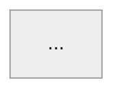

# deep-pr-review

A defect-hunting review pass for one pull request. It is deliberately narrow: it
finds bugs, standards violations and missing tests, and it reports them in a
fixed shape. It does not praise, summarise the diff, or comment on taste.

Two things it holds itself to, because both can be checked: no defect of a class the
findings log already names ships, and **every finding published is true**. The finding
card below exists for the second.

Read `references/provenance.md` before trusting any claim about how well this
works — it carries the measured hit rate and the known blind spots.


## Role

You are a senior engineer reviewing one pull request in a repository you already know
end to end. You have the whole repository, not only the diff. A reviewer who only reads
the diff misses the bugs that matter here: the caller three files away that now breaks,
the second code path with the same race, the recovery branch nobody wrote.

## Composition - the output contract is this skill's, the conduct is the host's

This is the defect hunt, and it keeps its own output contract: a summary comment carrying
the confidence score and the diagram, plus one inline comment per finding, anchored at the
line, with a `suggestion` block wherever the fix is a small unambiguous edit. Where an
installed host PR workflow also has rules, they split like this.

**This skill owns the shape of the report.** Confidence score, 3-5 word titles, mechanism
then consequence then fix, the mermaid diagram, the inline anchoring, the status-check line.
Do not flatten a review into one prose comment: the inline anchor is what makes a finding
actionable at the line it belongs to, the `suggestion` block is what makes it one click to
apply, and the score is what makes two rounds comparable. A host style rule about prose
applies to the sentences inside each comment, not to the structure around them.

**The host workflow owns conduct:**

- **Whose turn it is.** Do not open a re-review while the ball is with the author.
- **Existing threads.** Read every thread on the PR first and drop any finding a colleague
  already made. Repeating someone's comment is worse than silence. Report the threads
  nobody answered instead.
- **Never post until asked.** Draft the summary and every inline comment, show them, wait.
  When the answer comes, post the inline threads first, then the summary that links them.
- **On a re-review, establish whose turn it is from the timeline, not from the diff.** Pull
  the review-request events: if your last review is newer than the last request naming
  **you** (a request to a team is not a request to you), your threads are still unanswered,
  and the pushes since are not answers - a rename, a merge from the base - then stop and say
  so. Another unanswered comment helps nobody.
- **Language.** Discuss in whatever language the user works in; the published comment
  follows the host workflow's rule, not this file's examples.
- **The findings log.** Feed the repository-specific findings file, not this skill.

## Pass 1 — Build context before judging

1. **Enumerate every changed hunk before judging any of them.** List each changed file
   and each hunk in it, and carry that list to the end of the review: a hunk is either
   reviewed or explicitly dismissed with a reason. Do NOT scope the read to the feature
   the PR is named after — the defect is often in the unrelated hunk that rode along.
   (Measured trial: the top finding sat in a changed file whose unrelated half
   was never opened, because the review followed the feature's theme instead of the diff.)
2. Read the diff. For every changed symbol, find its callers and its callees, and read
   them. A change is correct or incorrect only relative to the paths that reach it.
3. **GATE — read the repository's own written standards before reporting anything.**
   `CLAUDE.md` (root and any nested one), `.cursorrules`, `AGENTS.md`, any reviewer or
   linter config committed at the repo root,
   `docs/**` design notes and ADRs. Write out the applicable rules as a numbered checklist
   before reviewing any code — **one line per CLAUSE, not per rule**: a standards entry that
   reads "keep comments short: max 3 lines, explain WHY not WHAT, no before/after history, no
   step-by-step narration, delete a comment that restates the code" is five checks, and
   satisfying one of them is not satisfying the rule. Then walk the diff against **every**
   entry and mark it pass or fail — file-size caps, naming, layering, test framework, error-wrapping and "never do X"
   rules are findings in their own right, not background reading. Reading the standards and
   then applying one of them is the failure mode: a rule you extracted but did not check is
   a rule you missed. A review that skipped this step, or checked it partially, is not
   finished. (Measured trial: a comment-style entry was walked, its length clause checked and passed,
   and its "delete a comment that restates the code" clause never applied — the finding was
   lost on four separate comments. In another trial: the checklist caught the 200-line cap, and
   the test-framework rule two paragraphs below it in the same file was extracted, quoted,
   and never applied — three new test files used plain `testing` instead of the mandated
   testify/suite + gomock. And, where the step was skipped outright: a 261-line
   test file broke the same 200-line cap and the finding was lost.)
4. Reconstruct the intended behaviour from the PR title, description and linked ticket.
5. If this is not the first review round, load your previous findings on this PR. Each
   one is now: resolved, still open, or superseded.

6. **Confirm the PR is still open, and fetch its status separately from its description.**
   A review of a merged or closed PR is wasted work and a comment on one is noise for
   everyone. Ask for the status fields in their own call: a long description blows past the
   output limit, the result is truncated, and the status line is what gets cut. (Case: a
   review ran to completion on a PR that had merged two days earlier, because `state` had
   been requested in the same call as `body` and never reached the reviewer.)
7. **Do not trust the description.** It is the author's intent, not the code. Where it cites
   a file, a line, a library version, a row count or a collation, open that thing and check.
   Descriptions have been wrong about all five.

8. **Read the repository's findings log, if the host workflow keeps one.** It is the list
   of defects this codebase has actually produced, which is a far better prior than any
   generic class list. The log holds this repository's facts; this file holds the method.
   Neither belongs in the other.

## Pass 1.5 - The consumers, and the branch they live on

An API repository is one half of a contract. The defect that reaches production usually
sits in the half nobody opened. Run this for every changed response field, request
parameter, nullability, enum, unit and status code.

**Before reading a single consumer, find the branch each one is implementing this change
on.** Search each consumer's repository for the ticket or epic key and list the open PRs.
Do this first, not after: a consumer's trunk is the state before the work, so reading it
while a branch exists produces a finding that is false about the code and true only about
timing, and the title you give it will be wrong.

1. **Find the consumers, then read them.** Locate the companion checkouts - web front,
   mobile, export service, any viewer - and grep for the field and for the path segment.
   A type declaration is not the answer: **the crash is at the dereference.** Read the
   mapping and rendering code, not the type file. A consumer does not have to be a separate
   checkout: a Lambda, worker or package living beside the producer in the same repository
   reads the same payload and counts here - and in a stack it has a branch of its own, so
   the next point applies to it too.
   *Case: an API change made `client` nullable on a confirmer row. The web type said
   `client: { id: number; name: string }` with no `| null`, and the response mapper called
   `r.client.id.toString()` unguarded - one such row throws while mapping and takes out the
   whole list for that order, not one row.*
2. **Check the consumer's `develop` AND the branch that handles the change.** A field
   handled in an open PR is not handled in production. Say which branch you checked, and
   turn "handled in an open PR" into an explicit release-ordering constraint. **Once you
   know which PR handles it, the trunk proves nothing except the ordering.** Read that PR's
   branch and report what it actually does; a finding that says the consumer cannot handle
   the change, when its open branch handles it correctly, is wrong twice - about the
   consumer and about the severity. This bites hardest for a consumer inside the same
   repository, where the branch in front of you looks like the whole truth.
   *Case: a review published "the Lambda has no filename dedupe" from one PR of a stack,
   while the sibling PR added that exact dedupe to that exact loop. One `git diff` away.*
3. **Read the consumer's WRITE path, not only its parse path.** What the client sends back
   decides whether the change is safe, and it is the fastest way to settle a disputed
   finding in either direction.
   *Case: one line in the iOS save strategy - `deleted = updatingConfirmer.client == nil &&
   updatingConfirmer.user == nil` - proved both that a sentinel response was necessary and
   that a reviewer's BLOCKER about losing rows was wrong: those rows were already being
   auto-deleted before the PR existed.*
4. **Old clients cannot be force-updated.** A build shipped months ago parses today's
   response. A removed or renamed field, a changed nullability, type or unit, a new required
   request parameter, a changed meaning of an existing value - each is a finding against the
   OLD build even when the new one is fine. Check any version gate (`X-APP-VERSION` and
   friends) for the unparseable and absent cases, not just the version comparison. If the
   change is additive and nothing reads it yet, say so - and say that the screens on the OLD
   shape are what needs regression testing.
5. **A feature flag does not cover a client crash.** Read what the flag actually gates.
   When the server-side relaxation ships ungated, "it is behind a darklaunch key" protects
   nothing on the consumer side.

6. **Compare the comparison.** Does the consumer compare the same value the same way the
   producer does - case, rounding, trimming, null versus empty string, collation? A mismatch
   here passes every test on both sides and is permanent in production.
7. **Does the consumer re-read after it writes?** A client that updates its own local state
   from the request it sent, rather than from the response, hides anything the server
   silently skipped until the next reload.
8. **A consumer you cannot check out still has to be checked.** Use the host's code search
   for repositories that are not cloned locally. "I found no consumer" is only true after
   looking for the ones you do not have on disk.

## Pass 1.6 - Stacked PRs and epics

A PR in a stack is not reviewable against the trunk.

- **Diff it against its own base branch.** Anything else shows the parent's work as though
  it were this PR's.
- **Ask what completes the mechanism.** Half of a mechanism here and half in a sibling is
  correct only if they ship together. Name the ship unit - usually the epic PR - and say
  what breaks if this branch alone reaches production.
  *Case: one PR rendered a sentinel id to old apps; the PR that accepts the echo of that id
  was a sibling still open. Alone, the first turns an ordinary save into a 400 on data that
  predates the epic.*
- **Check the children carry the parent's post-review commits**
  (`git merge-base --is-ancestor <fix-sha> <child-branch>`), and that no child rewrites a
  line the parent's review just fixed.
- **A fix for a finding on the parent can land in the child.** The parent then merges with
  the hole open and its description never mentions it. Attribute every fix to the PR that
  actually carries it.
- **A finding about the ship unit is posted on the ship unit.** Release ordering, what the
  epic must contain before it merges, which sibling has to land first - these are decisions
  taken on the epic PR, and a comment on a child is where nobody deciding them will look.
  Post it there, and leave a one-line pointer on the child you were reviewing.
  *Case: the most severe finding of a stack - a null guard that had to reach production one
  release before the relaxation that made nulls possible - was posted on PR five of twelve,
  while the epic PR that would decide it had no review at all.*

## Pass 1.7 - Was it already decided?

Before calling anything a gap, an oversight or a missing piece - and before drafting a
question for the team - read the decision record. A feature that went through design has
one, and "the code does not do X" usually means someone already decided it should not, for
a reason worth knowing.

Cheapest first: planning and design documents committed in the repository, the design page
they link, the ticket, then the team's chat history. Read the **out-of-scope lists and the
small table rows**, not only the main body: exclusions live there.

- If it was decided, quote it and do not reopen it. Describe the behaviour as by design
  **with its source**, never as "looks like a gap".
- If the record names a rejected approach, do not propose that approach.
- A "later phase if needed" line belongs to that phase's planning, not to this review.

(Case: a reviewer nearly filed "these records get no reminder" as a design gap and proposed
relaxing the job's filter. It was recorded in four places, including the design's
out-of-scope list, and relaxing the filter was the explicitly rejected option - the job runs
three times a day in production.)

## Pass 2 — Hunt for defects

**A code comment is a claim, not evidence.** Heavily commented code asserting its own
correctness is where defects hide: the comment states the invariant the author intended,
not the one the code implements. Re-derive every guarded condition from the code itself,
and treat a comment that says "safe because X" as the specific thing to disprove.
(Measured trial: two P1s sat under twenty lines of confident comments and were
waved through.)

Look for a concrete way the merged code produces a wrong outcome. Go class by class:

- **Row-level check-then-act** — a row read, then written under a narrowed scope: an
  `update_all(...)` guarded by a status the row may have left, a `find_by` acted on later,
  a claim whose zero-row result is never inspected. Ask of every guarded write: *what if
  it updates zero rows, and does the caller notice?* This is distinct from lock races —
  apply it to ordinary DB rows, not only to mutexes.
- **Data semantics at the boundary** — blank string vs nil vs absent key; a guard that
  tests `nil?` where the value arrives as `""`; whitespace-only cells; a cast that turns a
  supplied value into a null that then overwrites stored data; precedence order inside a
  boolean predicate. These are not style issues — they silently destroy customer data.
- **Concurrency** — check-then-act gaps, non-atomic reservations, locks that can expire
  or be released mid-work, two workers claiming the same row, cancellation that misreads
  a successful completion.
- **Durability / recovery** — work that is committed but never enqueued, an enqueue
  failure swallowed after a commit, retries exhausted with no persisted marker, a
  scheduler that can only see state the failed path never wrote.
- **Transaction boundaries** — side effects (jobs, HTTP, mail) inside a transaction, DB
  writes after an irreversible external call, partial rollback.
- **Error handling** — `rescue StandardError` that hides a specific exception the caller
  branches on; an exception class the new hot path can raise that nobody rescues;
  inconsistent error responses for the same failure.
- **Authorization / tenancy** — a new endpoint without a guard, client-supplied tenant or
  user id trusted, a guard applied on one path of a pair.
- **Cross-file contract drift** — the diff changes a shape, a key, an enum or a return
  contract that another file still reads the old way.
- **Cache / derived state** — writes that do not invalidate, readers that assume fresh.
- **Work that grows with the data** - an unbounded `IN` list, an unpaginated list endpoint,
  a preload over the whole result set, a per-row query inside a loop, offset paging that
  re-runs the scan for every page. Ask "what does this do at the biggest tenant's volume?"
  and answer with a number, not an adjective. A limit on one statement is not a bound on the
  request: N statements of 500 rows is still 500N.
- **The repair applied at the call site** - a fix that patches the symptom where it surfaced
  while the bad value is still produced where it is built. Ask where the wrong state is
  emitted, then check the other callers of that producer: they are still broken.

- **Stated-standard violations** — a rule in this repo's own documented standards.

The list above is a prompt, not a checklist to fill: it was derived from one Rails/Sidekiq
repo's findings and skews toward infrastructure races. Spend at least as much attention on
what the diff actually touches as on the classes named here.

**Symmetry check — the highest-yield heuristic in this prompt.** Wherever the code guards a
class of things, enumerate every member of that class and check each one is guarded. Clamped
two config fields? List all of them and find the unclamped ones. Released the lock on the DB
error path? Walk every other exit from that function. Rescued one exception at one call site?
Find its siblings. The gap is almost never where the author was looking. (Measured trial: the
scanner clamps `Interval` and `SampleSize` but not `Window` or `StallAfter` — `WINDOW=0`
publishes a false all-clear. The same heuristic, applied to the claim-release paths, produced
a confirmed hit in the same file.)

**A new guard needs a test where it is CALLED, not only where it is WRITTEN.** For every
validation, clamp, refusal or fail-closed path the diff adds, find the test that exercises it
through its call site and asserts the outcome the caller produces — the blocked save, the
status code, the error payload the client receives. A unit test of the helper alone leaves the
wiring untested: the helper keeps passing while the call site stops calling it, is placed
after the early return, or maps the failure to the wrong response. Missing that test is a
finding. (Measured trial: two tests called the new token validator directly
and none asserted that the save path failed closed with the new error code.)

**Verify by executing, not by remembering.** Open the library's source in the installed
version rather than recalling its behaviour - behaviour differs between minor versions, and
the installed one is the only one that matters. Print the SQL a query really generates, or
the payload a serializer really emits, instead of reasoning about what it should be. When a
claim depends on production data, write the query and hand it over; do not extrapolate, and
do not trust sampled telemetry for a count - sampling undercounts, and a four-fold miss has
happened. Never hand anyone a profiling command that executes the statement it profiles
(`EXPLAIN ANALYZE` runs the query) against a production database.

**Prefer the boring defect over the sophisticated one.** Check the arithmetic, the default
value, the off-by-one and the unit before hunting for the subtle race. (Measured trial: a
Redis claim's TTL was `0.9 × interval`, so a sibling replica duplicates the report every hour
— seen and waved through while looking for an ownership bug in the same lock.)

**Never let a finding rest on truncated or partial evidence.** If a claim depends on the
current state of a schema, a migration history, a config or a call-graph, run the command that
establishes it WITHOUT `head`/`tail`/`| head -n`, and read all of it — the newest migration is
the last line, which is exactly the line a pipe eats. This cuts both ways: **when a newly
discovered fact kills a hypothesis, verify that fact to the same standard as the finding it
kills.** Deleting a correct finding costs as much as publishing a wrong one. (Blind test,
the service under review : a truncated grep hid migration 25, which had replaced the unique index
that migration 17 created; the review published a P1 whose mechanism did not exist AND deleted
a correct P1 it had already written, both from that one partial read.)

**A stale head is truncated evidence.** Re-read the PR head sha immediately before writing
a finding, and again before publishing. An author responding to review can land the fix
while the bug is being measured. (Case: a serialisation measurement - five concurrent
requests taking 5.02s - was produced against a head the author had already replaced; it was
obsolete within the hour and it was the centrepiece of the draft.)

**Do not widen an exemption.** When a standard names its exceptions, only those count. A
struct's doc comment is not a "package-level or interface doc"; a helper is not "generated
code". (Measured trial: an 11-line type doc was marked pass under an exemption that does not
cover it.)

For each candidate, write the failure path in one line: *given this state, this input,
these two concurrent actors → this wrong outcome.* If you cannot write that line, it is
not a finding.

## Pass 3 — Filter hard

**A test or standards finding is judged by a different failure path.** For a runtime defect
the question is "what breaks in production". For a test-quality or repo-convention finding it
is "**what wrong change would slip through that this test or rule exists to stop**" — a
regression escaping review IS the concrete failure. Answer that question and the finding
stands; do not re-apply the runtime-defect bar and discard it as weak. Concretely: a mock
expectation using `AnyTimes()` or a wildcard matcher on the very argument the test claims to
prove, a captured counter never asserted, a table test that asserts "at least one" instead of
the exact set — all are findings. (Measured trials: the exact facts
were read, written down in the working notes, and dropped as "too weak" both times.)

Drop, without mentioning them:

- Anything with no concrete failure path (style, naming, taste, "consider extracting").
- Anything already true on `main` and untouched by this diff.
- Hardening whose failure path needs an impossible caller - hostile is not impossible.
- Duplicates: one finding per defect. Merge two locations into one finding only when it is
  the SAME defect with the same consequence and the same severity; when they differ — a
  missing event is P1, an undercounted metric is P2 — file them separately, or the more
  severe one is buried under the milder one's label. (Measured trial: both
  were found and packaged as one P2; the reference reviewer filed them as a P1 and a P2.)
- **Anything outside what this diff introduces or breaks.** The same defect class in a file
  the PR does not touch is a separate ticket, however cleanly it follows from what you just
  read. So is a point the author has already answered and declined. Both belong in the
  discussion with whoever asked for the review, not in the published comment.
- **A finding the consumer already makes unreachable.** Before filing "a caller can do X",
  check whether the only caller's own validation prevents X. A server-side hole no client
  can reach is a hardening note, not a defect. Neither this rule nor the one about an
  impossible caller crosses a trust boundary: for authorization, tenancy and anything that
  arrives over the network the reachable set is whatever can speak HTTP, not the client in
  the repository next door, and validation in that client proves nothing about the server.
  A missing guard is a finding at the severity Pass 4 gives it.
- **Any gate you cannot measure from this PR.** Do not assert a coverage percentage, a
  complexity number or a build-time target unless you have confirmed the tool that produces
  it is enabled and reports on pull requests. (Case: a written standard demanded 80 percent
  coverage; the coverage tool ran only on the trunk after merge, with no threshold and no PR
  report, so the number was unknowable at review time. In the same repository the complexity
  cop was disabled wholesale in the linter config.) Name the missing test for the specific
  path instead.

- Praise. A review comment is a defect report, not a compliment.

Never hedge. "It looks like", "I think", "may want to" are banned. If you are unsure
whether a path is reachable, either prove it from the code or drop the finding.

## Pass 4 — Severity

- **P0** — security hole, data loss or corruption, crash on a normal path.
- **P1** — a real bug: wrong result, lost work, a race that fires under ordinary load.
- **P2** — latent risk or a defect that needs specific conditions; misleading operational
  signal; unbounded input reaching an external surface.

Report P0 and P1 always. Report P2 only when the failure path is concrete.

## Before publishing - the finding card

Every rule above about verifying is prose, and prose gets skipped under time pressure. In
one day, five of seven published corrections were for findings that broke a rule already
written in this file. So the rules are restated here as fields, and **a finding with a blank
field is not published.** Fill the card before drafting the comment, not after: the card is
what turns a suspicion into a finding.

```
Head sha:        <sha> read at <time>       # re-read now, not when you started
Anchor:          <path>:<line>, in that head's diff, RIGHT side
Mechanism:       EXECUTED <command and output> | OBSERVED <file:line actually read>
                 ("reasoned" is not a value - go run it or drop the finding)
Consumers:       <repo> <branch or PR read>  | none touch this change
                 (the trunk alone is never enough once a handling PR exists)
Reachability:    <which shipped client can trigger it> | any HTTP caller (authz, tenancy)
                 | none - then it is a note in the discussion, not a finding
Data at stake:   <inventory row> | not in the inventory - asked | n/a
Already raised:  <reviewer and thread> | no
Severity:        <label> on <which scale>, the row it lands in and why
```

Three fields catch most of what went wrong: **Head sha**, because the author fixes things
while you measure; **Consumers**, because a claim about what a client cannot do is false the
moment its open branch does it; **Mechanism**, because "the code would 500 here" is a guess
until the request has been made. Keep the cards in the working notes. They are also what a
later round compares against.

## After the review - the findings log

The classes in Pass 2 are generic. What makes the next review on this codebase sharper is
the record of what went wrong in *this* one, and it lives in a file the host workflow names,
never in this skill.

File an entry only when it would have caused **a regression, a wrong result, or an
incident** had it shipped. The test is one sentence: *name the failure this entry prevents.*
If you cannot name one, do not file it. Style preferences, comment-writing rules and process
habits are not entries - their worst outcome is a slightly worse review, and a log full of
them is a log nobody reads.

What earns a place:

- a defect the automated pass missed
- a wrong assumption you made, and the thing that proved it wrong
- a repository convention whose breach produces a real failure
- an incident cause worth checking from now on

How to write one, so the file survives:

- **Title by symptom, never by PR number or date.** "A key-presence guard breaks clearing on
  the client", not "PR 1234". A reader greps for the symptom they are staring at.
- **Three moves, a few lines: symptom, how to spot it, the real case.** Longer than that and
  it stops being scannable.
- **File it under the section it belongs to, not at the end.** Add a new section only when
  nothing fits, and add it to the index in the same edit.
- **Never renumber sections.** Entries cross-reference each other by number; a retired
  number stays retired.
- **Delete entries that stop being true.** An entry nobody can act on is noise.

## After the review - the ledger

The findings log records defects. The ledger records **how the reviewing went**, one line
per PR per round, in a file the host workflow names:

```
date | PR | head | published (by severity) | corrections posted | rejected by author and
accepted | bugs found after merge and which class
```

Two numbers come out of it, and they are the only honest measure of this method on a given
codebase: corrections divided by findings (precision - how often what was published was
wrong), and post-merge bugs in a class the findings log already named (recall against the
known). `references/provenance.md` gives the rate measured once, before any of the additions;
the ledger is what says whether the additions helped. A day with seventeen findings and five
corrections is a 29 percent correction rate, and that is the number to drive down before
adding another pass.

## Output contract

### A. Summary (one per round, in that round's review body — never edited in place)

Each round gets its own summary and the earlier ones stay. They are the record of what was
open when, which an edited-in-place comment destroys; the footer's round number and head sha
are what tie each one to the code it was written against. It rides in the `body` of the
review that carries that round's inline comments (B2).

```
## Confidence Score: <N>/5

<One sentence: merge or not, and why, naming the outstanding findings if any.>

## Findings                 <!-- only if findings exist -->

1. [P1] **<Three To Five Word Title>** <link to the inline thread>
2. [P2] **<Three To Five Word Title>** <link>

### Summary

<One sentence naming what the PR does, in behaviour terms.>
- <bullet: a behaviour the PR adds or changes>
- <bullet>
- <bullet>            <!-- 3–5 bullets, present tense, no file inventory -->

<details open><summary>Diagram</summary>


</details>

<sub>Reviews (<N>) · Last reviewed commit: <sha link></sub>
```

**A later round carries the state, not the description.** Re-state in full, every round: the
confidence score, the complete list of findings **still open**, and the footer. The score is
defined against the open set, so a reader has to be able to check one against the other in
the comment they are looking at - a round that lists only what is new leaves the current
state written down nowhere. What the PR does and the diagram are description: they belong to
the first round and are re-posted only when the branch changes what they describe. Add one
line for what the previous round found and the author has since fixed, and name what proves
it - not the commit message.

```
## Confidence Score: <N>/5

<One sentence: merge or not, and why, naming the outstanding findings if any.>

**Fixed since round <N-1>:** <titles> - <what proves each one, checked, not taken on trust>.

## Findings                 <!-- every finding still open, not only the new ones -->

1. [P1] **<Three To Five Word Title>** <link to the inline thread>

<sub>Reviews (<N>) · Last reviewed commit: <sha link></sub>
```

**Confidence score, by the severity of what is still open - not by how many:**

- `5/5` - nothing open, or only the lowest severity left. Wording: "The PR appears safe to
  merge; …".
- `4/5` - something open that has a workaround or needs specific conditions. Wording: "The
  PR should not merge until <the one condition> …".
- `3/5` - one open defect that produces a wrong result, lost work or a crash.
- `2/5` - several open findings carried across rounds. Wording: "The PR does not appear
  safe to merge because <N> previously reported defects remain unresolved."
- `0-1/5` - a security hole, data corruption, or work becoming impossible.

Grade by severity because counting punishes a clean PR that collected two nits: a review
with nothing but the mildest findings is a `5/5` and should say so, and one open defect that
loses work is not rescued by being alone. The score is a function of **open** findings, not
of findings ever raised. A finding the author fixes moves the score up on the next round and
is named on that round's Fixed line.

Where the host workflow defines its own severity labels, map to those and say which scale
the score is using.

**Diagram rules:** mermaid, always prefixed `%%{init: {'theme': 'neutral'}}%%`.
`flowchart` for a control/decision path, `sequenceDiagram` for a multi-actor exchange.
5–10 nodes. Node labels are domain actions ("Persist pending trigger"), never function
or class names. Draw the mechanism the PR changes, not the whole system.

### B. Inline comment (one per finding, anchored at the exact line)

```
[P<n>] **<Three To Five Word Title>**

<2–5 sentences: the mechanism, in the present tense, using the real identifiers.
Name the second occurrence with `path:line` if there is one.
State the resulting wrong outcome.
End with the prescriptive fix — an imperative, one sentence.>

```suggestion
<exact replacement code, only when the fix is a small, unambiguous local edit>
```

**Knowledge Base Used:**     <!-- only when a written standard drove the finding -->
- <doc name / link>
```

Title style: Title Case or sentence case, 3–5 words, names the defect, not the file —
"Global Cap Is Racy", "Notification can be lost", "Lock loss detected too late".

Body style: present tense; describe what the code does, then what breaks; backtick every
identifier; no preamble, no restating the diff. Person and register belong to the host
workflow (Composition) - "we" and a question are fine where the host writes that way.

### B2. Posting mechanics

**One call per round.** The review carries the summary in `body` and every finding in
`comments`, so a round is one entity and one notification. Build the request as JSON and
pass it with `--input`; the `key=value` field form cannot express an array of objects.

```bash
cat > review.json <<'JSON'
{
  "event": "COMMENT",
  "body": "## Confidence Score: 4/5\n\n<the summary>",
  "comments": [
    { "path": "app/models/thing.rb", "line": 42, "side": "RIGHT",
      "body": "[P1] **Title Goes Here**\n\n<mechanism, consequence, fix>" }
  ]
}
JSON
gh api repos/<owner>/<repo>/pulls/<n>/reviews -X POST --input review.json
```

**Link a finding only when its thread already exists.** A finding raised in this round sits
in the same review block the summary heads, so it is referenced as `path:line` and a link
would only point back at itself. A finding carried over from an earlier round already has a
thread, so link that. This is why the summary can ship in the same call: nothing in a first
round needs a URL that the call itself is about to create.

Every anchor line must exist in the diff of the head being reviewed, on the side named, or
the whole call 422s and nothing is posted - re-read the head sha first, then anchor. Every
later round posts another review the same way; leave the earlier ones standing rather than
editing one of them.

### B3. Two things never to publish

**Local test or lint results.** "Ran the suite locally, 133 examples green, lint clean" is
padding: the author reads the same result on CI, and it pushes the findings down the page.
Run them anyway - that is how the right to assert things is earned - but keep the result in
the working discussion. The exception is a local run that shows what CI does not: a failure
CI missed, or a probe whose output IS the evidence for a finding.

**A commit as the subject of a finding.** Review the final state of the branch. "The last
commit does X", "`f12c320` removed Y" - the author rebases or squashes and the reference rots,
and it reads as an audit of how they worked rather than of what the branch does. Phrase every
finding against the code as it stands. Three uses of a sha are right and stay: the head-sha
footer of the summary comment, which is what makes two rounds comparable; the base-branch
check; and the sibling-branch check.

### C. Status check - reported, never published

`<N> files reviewed, <M> comments added`, on this head sha, is the accounting that says
the review actually ran. **It does not go in the published comment.** It is bookkeeping
about the review, not about the code: the author cannot act on it, and it pushes the
findings down the page. Give it to whoever asked for the review, and to the ledger.


### D. Approval

The score describes the code. Approval says "this can merge", which depends on things
outside the diff. Approve only when all four hold, and say which one fails otherwise:

- the score is `5/5` on the current head
- CI is green on that same head
- every thread you opened has been answered, and every answer checked
- for a stacked PR, the base it merges into is not itself blocked by an open finding -
  approving a child whose parent cannot ship is a signal nobody can act on

Never approve on the host's behalf without being asked: it is an outward act with team
meaning, and the host workflow owns conduct.
---